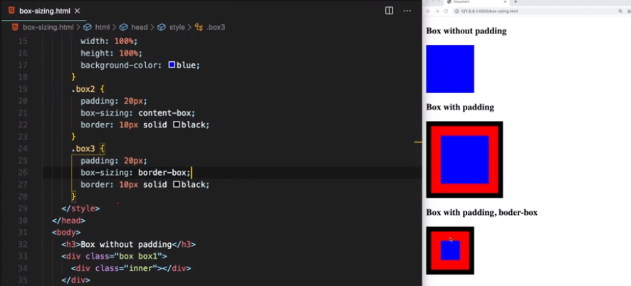
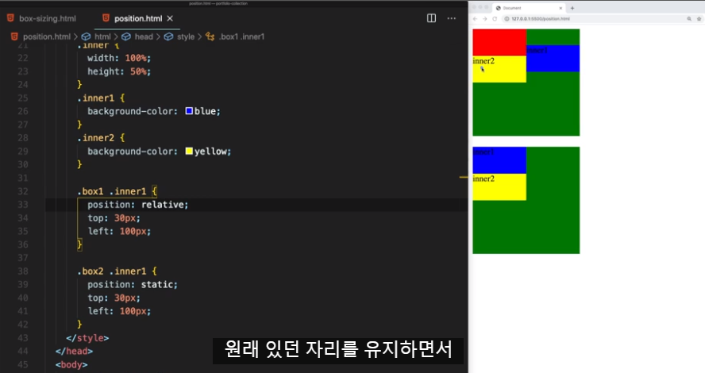
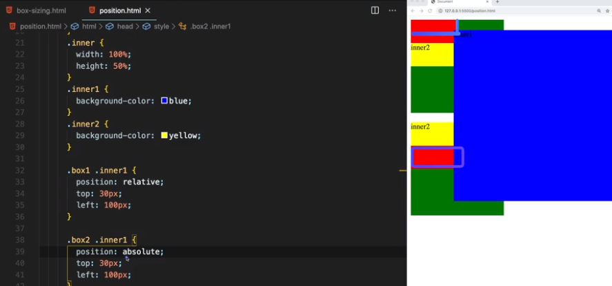
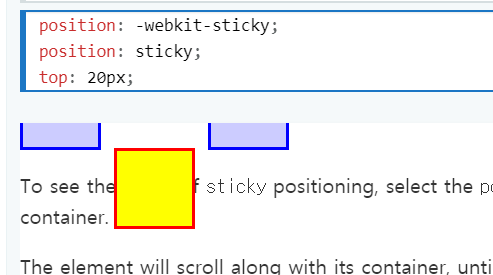
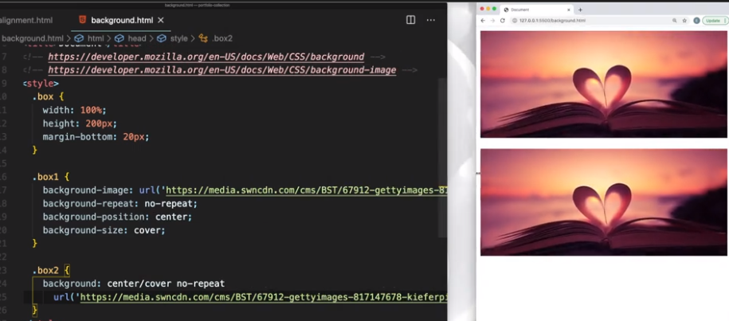
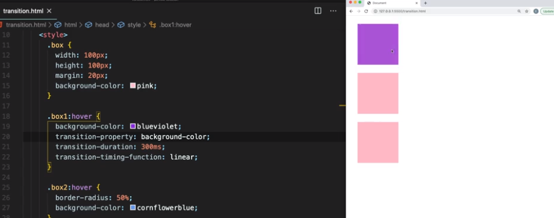
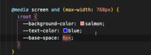

# Portfolio 

## 프로젝트 전반

### 걸린 시간

2020.11.21 ~ 


### 목적

1. 포트폴리오

2. 순수 HTML, CSS, JavaScript 사용한 프로젝트 경험

   

### 사용된 언어

1. HTML

2. CSS

3. JavaScript

   

### 적용한 규칙

1. BEM
   - Blocks, Elements and Modifiers
   - 예시) .card__button--blue
   - http://getbem.com/introduction/


### 참고한 사이트

1. 브라우저 별 사용가능한 기술 체크

   https://caniuse.com/

2. MDN

   https://developer.mozilla.org

3. cubic-bezier

   https://cubic-bezier.com


## 배운 점

### HTML 

1. meta

   - <meta name="description" content="Portfolio for software engineer JY"><meta name="author" content="JY">

2. favicon
   
   - <link rel="icon" type="image/png" href="images/favicon.png">


3. data attribute

   - article.dataset.columns = 5  would change that attribute to  "5"
   
   ```html
<article
     id="electric-cars"
     data-columns="3"
     data-index-number="12314"
     data-parent="cars">
   ...
   </article>
   ```
   
   ```javascript
const article = document.querySelector('#electric-cars');
   const article = document.querySelector('article[data-parent="cars"]');
    
   article.dataset.columns // "3"
   article.dataset.indexNumber // "12314"
   article.dataset.parent // "cars"
   ```
   
```css
   article::before {
     content: attr(data-parent);
   }
   article[data-columns='3'] {
     width: 400px;
   }
   article[data-columns='4'] {
     width: 600px;
   }
   [data-parent='cars'] {
       
   }
   ```
   
   


### CSS 

1. box-sizing

   - https://developer.mozilla.org/en-US/docs/Web/CSS/box-sizing

   


2. position

   - https://developer.mozilla.org/en-US/docs/Web/CSS/position

   - relative - 원래 있던 자리에서 top 30, left 100 이동, inner2는 이동 x

   

   

   - absolute - 근접한 부모 중에 static 아닌 부모의 기준에서 이동(크기도 그 부모에 맞게), inner2도 이동

   

   

   - -webkit-sticky - 들어있는 박스 안에서 top 20에 붙어, top, left 등의 속성 지정해주어야 함

   


3. 중앙 정렬
   - margin auto - 블록의 경우 오른쪽에 자동으로 마진 들어감, 이때 margin auto 하면 중앙 정렬
   - text-align center - 인라인의 경우 위의 요소에서 적용 가능
   - transform - transform: translate(50%, 50%)
   - line-height - 텍스트의 경우 수직도 중앙으로 정렬하고 싶으면 사용


4. 백그라운드 이미지(반응형)

   - background-size: cover 적용

   


5. transform
   - translate - x,y 축 이동, 기준점에서부터 
   - scale - 크기, 배수로 
   - rotate - 회전


6. transition

   - transition-property: background-color
   - transition-duration
   - transition-timing-function
   - 축약형: transition: all 300ms ease
   - cubic-bezier: timing-function 취향대로 변경 가능 https://cubic-bezier.com/#.17,.67,.83,.67

   


7. css variable

   - https://developer.mozilla.org/en-US/docs/Web/CSS/--*

   - var: css 에서 정의해놓은 함수 사용, 이것도 자식 요소에 상속 가능
   - calc: calc(var(--first-color) * 2) 이렇게도 사용 가능

   ```css
   :root {
     --first-color: #488cff;
     --second-color: #ffff8c;
   }
   
   #container {
     --first-color: #48ff32;
   }
   
   #thirdParagraph {
     background-color: var(--first-color);
     color: var(--second-color);
   }
   ```

   

   - 미디어쿼리에 적용할때 꿀(:root만 바꿔주면 됨)

   


